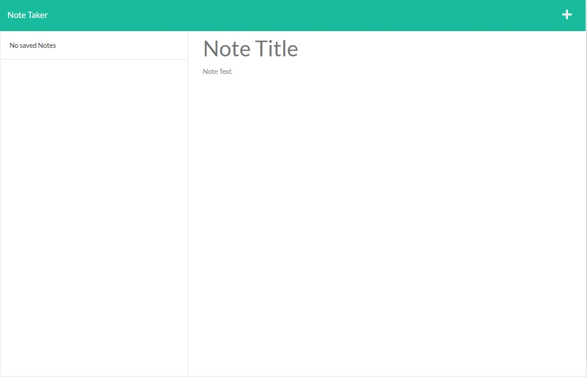

# homework-express-js

## Description
This project will run on heroku server and will save notes so that one can organise things and keep track of tasks.
    
## Table of Contents
- [Installation](#installation)
- [Usage](#usage)
- [URL (deployed application)](#url)
- [URL (github repository)](#urlrepo)
- [Screenshot](#screenshot)
- [WalkthroughVideo](#walkthroughvideo)
- [License](#license)
- [Questions](#questions)

## Installation  

To install type

    npm install

This will install all the dependency modules
      
## Usage      
    npm start

To start the project, type the above command and server will start running.

## URL (deployed application)

Following is the url link to access the deployed application.

https://pacific-ridge-02925.herokuapp.com/

## URL (github repository)

Following link is to access the code files using github repository.

https://github.com/muradmanni/homework-express-js

## Screenshot

## WalkthroughVideo

## License
This project is covered under MIT License. 
            For more information [click here](https://opensource.org/licenses/MIT)
      
## Questions
Feel free to email at murad.manni@gmail.com, if you have any further questions relating to this project.

Checkout more on [Github](https://github.com/muradmanni)
    